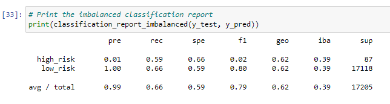
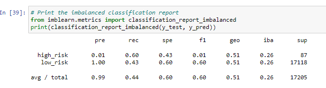
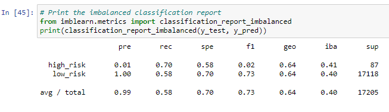
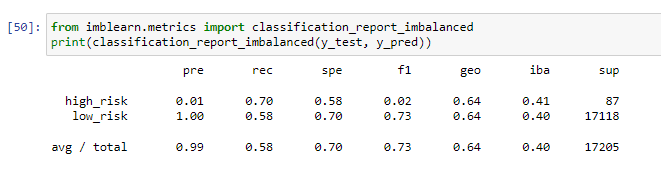
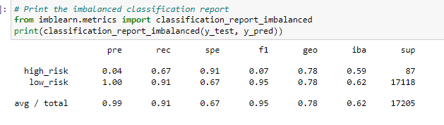
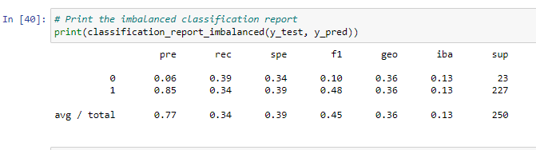

# Credit_Risk_Analysis

# Overview of the analysis: Explain the purpose of this analysis.
Employ different techniques to train and evaluate models with unbalanced to determine credit card risk. 

# Results: Using bulleted lists, describe the balanced accuracy scores and the precision and recall scores of all six machine learning models. Use screenshots of your outputs to support your results.

Precision is very high but recall is lower at 66

Precision is very high but recall is lower at 44

Precision is very high and recall is coming up at 58

Precision is very high and recall is getting higher

Precision is very high and recall is very high at 91

Precision is mid high and recall is lower at 34

# Summary: Summarize the results of the machine learning models, and include a recommendation on the model to use, if any. If you do not recommend any of the models, justify your reasoning.
I would recommend using the Balanced Random Forest Classifier because this produced the highest metrics. I wouldn't recommend Easy Ensemble AdaBoost Classifier because this was the lowest performing model. 
